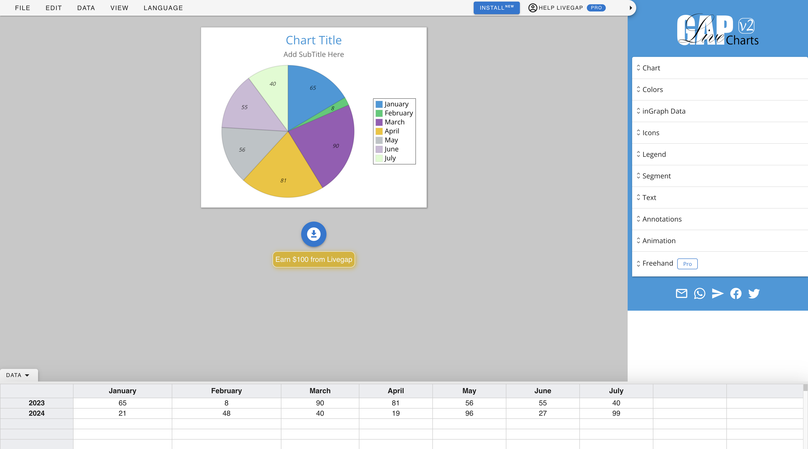

# Line Chart

Line Charts are ideal for displaying trends over time or comparing multiple data sets.

Here's a detailed guide on how to create and use a line chart with LiveGap charts.

## How to create and use a Line Chart

### Step 1: Create a Line Chart

To create a new Line Chart, click the `Make your Chart` button on the [LiveGap Charts Home screen](https://charts.livegap.com/) and then select `Line Chart` from the list of options presented.

This will open the Chart editor with the default line chart loaded.

You can load a different line chart from the `Gallery` by clicking the `SELECT CHART` button under the `CHART` tab in the right sidebar.

### Step 2: Add data to your chart

Add your data to your line chart using the spreadsheet at the bottom of the screen.

<em>Customize chart in editor</em>

You may also import data from an existing spreadsheet (`.csv` file) by clicking the `DATA` tab in the header and then clicking `Import`.

### Step 3: Customize your Chart

Customize your chart using the various customization options in the right sidebar.

!!! tip
    Swipe left on a mobile device to open the right sidebar.

Here's a detailed description of what each option does.

[Detailed desc]

### Step 4: Save your Chart

First, edit your chart's title and subtitle by clicking `Chart Title` and `Add SubTitle Here` or by using the `Text` tab in the right sidebar.

To save your chart locally to your device, click the download icon beneath your chart and choose your desired download option by clicking on one of the popup icons.

You can choose to save your chart as an Image, Video, or in HTML.

To save your chart online, click the `FILE` tab in the header and then click `Save Online` from the dropdown.

!!! tip
    Click `My Charts` under the `VIEW` tab in the header to open a chart previously saved online.

### Step 5: Export data (Optional)

If desired, export the data used to create the chart as a spreadsheet (`.csv` file) by clicking the `DATA` tab in the header and then clicking `Export`.
