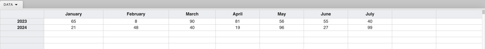

# Polar Area Chart

Polar area charts are similar to radar charts but use a polar coordinate system instead of a Cartesian coordinate system. This means that the data points are plotted on a radial scale that extends outward from the center of the chart, with the angles representing different categories or criteria.

Key features and uses of polar area charts:

* **Visualize cyclical or periodic data**: Ideal for representing data that repeats over time or within a cycle (e.g., seasonal variations, daily patterns).
* **Compare multiple data sets with a common set of categories**: Similar to radar charts, polar area charts can compare data sets based on multiple criteria.
* **Emphasize the overall shape or pattern of the data**: The shape of the chart can reveal trends, similarities, and differences between data sets.
* **Highlight the relative importance of different categories**: The area of each segment in the chart represents the magnitude of the data point, making it easy to compare the relative importance of different categories.

Here's a detailed guide on creating a Polar Area chart with LiveGap charts.

## How to create and customize a Polar Area Chart

### Step 1: Create a Polar Area Chart

To create a new Polar Area Chart, click the `Make your Chart` button on the [LiveGap Charts Home screen](https://charts.livegap.com/) and select `Polar Area Chart` from the list of options.

This will open the Chart editor with the default Polar Area chart loaded.

You can load a different Polar Area chart from the `Gallery` by clicking the `SELECT CHART` button under the `CHART` tab in the right sidebar.

### Step 2: Add data to your chart

Add your data to your Polar Area chart using the spreadsheet at the bottom of the screen.

<em>Customize chart in editor</em>

You may also import data from an existing spreadsheet (`.csv` file) by clicking the `DATA` tab in the header and then click `Import`.

### Step 3: Customize your Chart

Customize your chart using the various customization options in the right sidebar.

This [table](#customization-options) describes what each option does.

<!-- !!! tip
    Swipe left on a mobile device to open the right sidebar. -->

### Step 4: Save your Chart

First, edit your chart's title and subtitle by clicking `Chart Title` and `Add SubTitle Here` or by using the `Text` tab in the right sidebar.

To save your chart locally to your device, click the download icon beneath your chart and choose your desired download option by clicking on one of the popup icons.

You can choose to save your chart as an Image, Video, or in HTML.

To save your chart online, click the `FILE` tab in the header and then click `Save Online` from the dropdown.

!!! tip
    Click `My Charts` under the `VIEW` tab in the header to open a chart previously saved online.

### Step 5: Export data (Optional)

If desired, export the data used to create the chart as a spreadsheet (`.csv` file) by clicking the `DATA` tab in the header and then click `Export`.

## Customization Options

### Chart

| **Option**         | **Type**          | **Function**                                                                                              |
|--------------------|-------------------|----------------------------------------------------------------------------------------------------------|
| **Gallery**        | Menu            | Opens the gallery, allowing you to select from a range of pre-made chart templates.                                                    |
| **Chart Type**     | Dropdown          | Allows selection of the type of chart (e.g., Line Chart, Bar Chart, etc.).                                |
| **Link Type**      | Dropdown          | Determines how data points are connected (e.g., point-to-point, spline).                                  |
| **Width**          | Slider            | Adjusts the overall width of the chart.                                                                   |
| **Height**         | Slider            | Adjusts the overall height of the chart.                                                                  |
| **Total Amplitude** | Input Field | Sets the total amplitude for the chart.             |
| **Start Angle**   | Slider      | Adjusts the starting angle of the chart.             |
| **BackColor**      | Color Picker      | Changes the background color of the chart. Click the `+` button to add more colors.                                                                |
| **Canvas**        | Button      | Opens additional options for adjusting the canvas (padding, margin, color, border, etc.).              |
| &nbsp;&nbsp;&nbsp;&nbsp;**Border**         | Button + Toggle            | Toggles border around the chart and opens additional settings for customizing it.                                        |
| &nbsp;&nbsp;&nbsp;&nbsp;**Box Shadow**      | Toggle            | Toggles a shadow effect around the chart and opens additional settings for customizing it.                                                    |
| **Format**     | Section            | Opens settings for customizing how numbers are displayed on the chart.                                                    |

### Colors

| **Option**         | **Type**          | **Function**                                                                                              |
|--------------------|-------------------|----------------------------------------------------------------------------------------------------------|
| **Fill**           | Toggle            | Enables or disables the filling of the area under the lines in the chart with color.                      |
| &nbsp;&nbsp;&nbsp;&nbsp;**Fill style**    | Button        | Opens options to set the fill style for each line (between color, gradient, and pattern).                |
| &nbsp;&nbsp;&nbsp;&nbsp;**Color Picker**    | Button        | Opens a color picker to set the fill color.                |
| &nbsp;&nbsp;&nbsp;&nbsp;**Fill pattern**    | Dropdown        | Opens options to set the fill pattern type for each set of bars (only available when fill style is set to pattern)                 |
| &nbsp;&nbsp;&nbsp;&nbsp;**Style**           | Button        | Opens the color scheme selection window.                   |

### In-Graph Data

| Option             | Type      | Function |
|--------------------|-----------|----------|
| **In-Graph Data**  | Switch + Button  | Toggle the display of in-graph data on or off and opens customization options. |
| **Type**               | Dropdown  | Selects the type of data to display in-graph, such as value, percentage, or label |
| **Position**           | Button + Section   | Opens configuration options for the position of in-graph data. |
| **Padding X**          | Slider    | Adjusts horizontal padding of the in-graph text. |
| **Padding Y**          | Slider    | Adjusts vertical padding of the in-graph text. |
| **Align**              | Dropdown  | Sets horizontal alignment of the in-graph text. Options include left, center, and right. |
| **VAlign**             | Dropdown  | Sets the vertical alignment of the in-graph text. Options include top, middle, and bottom. |
| **Rotate**             | Slider    | Adjusts the rotation angle of the in-graph text. |
| **BackgroundColor**    | Checkbox + Color pricker  | Enables a background color for the in-graph text. |
| **Border**             | Checkbox + Color picker  | Enables a border around the in-graph text and enables you to change its color. Click the `+` button to add separate colors for each set of data points. |
| **Padding**            | Slider | Adjusts the padding of the in-graph text's bounding box. |
| **Font**               | Button + Section   | Allows customization of the font settings for in-graph data. |
| **Font Family**        | Dropdown  | Selects the font family. Default is 'Open Sans'. |
| **Font Style**         | Icons     | Options to change the font color or make the font bold or italic. Click the `+` button to add separate colors for each set of data points. |
| **Font Size**          | Slider    | Adjusts the font size for in-graph text. |

### Legend

| Option               | Type                        | Function |
|----------------------|-----------------------------|----------|
| **Columns**           | Slider                      | Adjusts the number of columns in the legend. |
| **BlockSize**         | Slider                      | Modifies the size of each block of text and icons in the legend. |
| **Position**          | Section                     | Controls the position of the legend on the chart. Options include `X Position` (Left, Center, Right) and `Y Position` (Top, Middle, Bottom). |
| **Padding X**         | Slider                      | Adjusts the horizontal padding around the legend. |
| **Padding Y**         | Slider                      | Adjusts the vertical padding around the legend. |
| **Background Color**  | Color Picker                | Sets the background color for the legend. |
| **Margin**            | Slider                      | Adjusts the margin around the entire legend box. |
| **Border**            | Multiple     | Lets you set a border around the Legend and change its color, line type, etc. |
| **Padding**           | Slider                      | Adjusts the padding inside the legend box. |
| **Space**           | Multiple sliders                      | Adjusts the legend's logo and text spacing.   |
| **Font**               | Section   | Allows customization of the font settings for the legend. |
| **Font Family**        | Dropdown  | Selects the font family. Default is 'Open Sans'. |
| **Font Style**         | Icons     | Options to change the font color or make the font bold or italic. |
| **Font Size**          | Slider    | Adjusts the font size for the legend. |

### Segment

| Option         | Type        | Function                                           |
|----------------|-------------|----------------------------------------------------|
| **Line Color** | Color Picker| Sets the color of the segment lines.               |
| **Line Style** | Dropdown    | Selects the style of the segment lines (e.g., solid, dashed). |
| **Line Width** | Slider      | Adjusts the width of the segment lines.            |

### Scale

| Option            | Type        | Function                                                   |
|-------------------|-------------|------------------------------------------------------------|
| **Show Labels**   | Checkbox    | Toggles the visibility of labels on the scale.             |
| **Label**         | Input Field | Sets the text for the scale labels.                        |
| **Show Line**    | Checkbox | Toggles the visibility of the line                      |
| **Line Color**    | Color Picker| Selects the color of the scale lines.                      |
| **Line Width**    | Slider      | Adjusts the width of the scale lines.                      |
| **Line Style**    | Dropdown    | Selects the style of the scale lines (e.g., solid, dashed).|
| **Override**      | Switch + Section      | Allows manual adjustment of scale starting value, step, and width.                   |
| **Tick Size**     | Sliders     | Adjusts the size of ticks on the scale (Top, Bottom, Left, Right). |
| **Font**               | Section   | Allows customization of the font settings for the scale. |
| **Font Family**        | Dropdown  | Selects the font family. Default is 'Open Sans'. |
| **Font Style**         | Icons     | Options to change the font color, or make the font bold or italic. |
| **Font Size**          | Slider    | Adjusts the font size for the scale. |

### Grid

| Option         | Type        | Function                                               |
|----------------|-------------|--------------------------------------------------------|
| **Line Color** | Color Picker| Selects the color of the grid lines.                   |
| **Overlay**    | Checkbox    | Toggles the overlay of grid lines on the chart.        |
| **Line Style** | Dropdown    | Selects the style of the grid lines (e.g., solid, dashed). |
| **Line Width** | Slider      | Adjusts the width of the grid lines.                   |
| **X Lines Step**| Slider     | Adjusts the spacing between vertical grid lines.       |
| **Y Lines Step**| Slider     | Adjusts the spacing between horizontal grid lines.     |

### Text

| Option         | Type        | Function                                               |
|----------------|-------------|--------------------------------------------------------|
| **Title** | Section | Options to customize the chart's title's text, color, fonts, etc.                   |
| **SubTitle**    | Section    | Options to customize the chart's subtitle's text, color, fonts, etc.       |
| **Footnote**    | Section    | Options to customize the chart's footnote's text, color, fonts, etc.       |

### Annotations

| Option          | Type         | Function                                              |
|-----------------|--------------|-------------------------------------------------------|
| **Annotations**       | Toggle     | Toggles the display of data annotations on the chart when hovering over points with the mouse.     |
| **Value**       | Dropdown     | Selects the data value to annotate on the chart (percentage, label, or value).      |
| **BackColor**   | Color Picker | Sets the background color for the annotation.         |
| **Padding**     | Sliders      | Adjusts the padding around the annotation (Top, Left, Right, Bottom). |
| **Border**      | Button + Toggle       | Configures the border settings for the annotation.    |
| **Font**        | Button       | Opens font customization options for the annotation text. |

### Animation

| Option         | Type        | Function                                                  |
|----------------|-------------|-----------------------------------------------------------|
| **Steps**      | Slider      | Adjusts the number of steps in the animation.             |
| **Easing**     | Dropdown    | Selects the easing function for the animation (e.g., Linear). |
| **In & Out**   | Dropdown    | Chooses the animation direction (In, Out).               |
| **By Dataset** | Checkbox    | Animates the chart according to the dataset.                            |
| **Left To Right** | Checkbox | Animates the chart from left to right.                    |
| **Animate**    | Button      | Starts the animation.                                     |

### Freehand

| Option            | Type        | Function                                                     |
|-------------------|-------------|--------------------------------------------------------------|
| **Stroke Roughness** | Slider   | Adjusts the roughness of the stroke lines.                   |
| **Stroke Bowing** | Slider      | Controls the bowing effect of the stroke lines.              |
| **Fill Style**    | Dropdown    | Selects the fill style for the chart elements (e.g., Hachure). |
| **Fill Weight**   | Slider      | Adjusts the weight of the fill lines.                        |
| **Fill Roughness**| Slider      | Controls the roughness of the fill.                          |
| **Fill Bowing**   | Slider      | Adjusts the bowing of the fill lines.                        |
| **Hachure Angle** | Dropdown    | Sets the angle of the hachure lines.                         |
| **Hachure Gap**   | Slider      | Adjusts the gap between hachure lines.                       |
