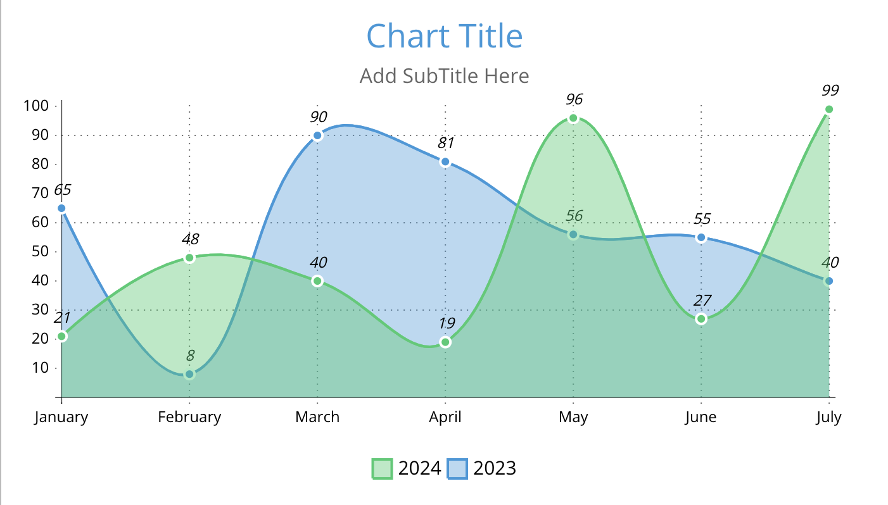

# Create your First Chart

Here's a quick guide to creating your first chart using LiveGap Charts.

## Step 1: Open LiveGap Charts

To begin, visit the LiveGap Charts website by navigating to [https://charts.livegap.com/](https://charts.livegap.com/) in your browser or clicking the LiveGap Charts app icon if installed on your device.

## Step 2: Select Chart Type

Next, click the `Make your Chart` button and then select your desired chart type from the list of options presented. Selecting a type opens the chart editor.

<em>Select desired chart type</em>

## Step 3: Add Data

In the chart editor, you can add custom data using the spreadsheet at the bottom of the screen.

<em>Add data to chart</em>

You may also import data from an existing spreadsheet (`.csv` file) by clicking the `DATA` tab in the header and then clicking `Import`.

<!-- !!! tip
    Swipe left on a mobile device to open the right sidebar. -->

## Step 4: Customize Chart

Use the sidebar on the right of the screen to fully customize the look and feel of your chart.

Click the `Colors` tab and toggle the `Fill` switch on to fill the area under the lines in the line chart with color. You can change these colors with the color picker under the `Stroke` section.

Now click the `Dataset` tab and click the `Bezier Curve` checkbox beneath to smoothen the connecting lines.

Your chart should now look something like this.

<em>Edit chart</em>

## Step 5: Save Chart

First, edit your chart's title and subtitle by clicking `Chart Title` and `Add SubTitle Here` and then changing the corresponding fields under the `Text` tab in the right sidebar.

Finally, click the save button beneath the chart and choose your preferred download option via the popup buttons to download your chart to your device.

You may also save your chart online.

To do so, click the `FILE` tab in the header and then click `Save Online` from the dropdown.

<em>Save chart</em>

